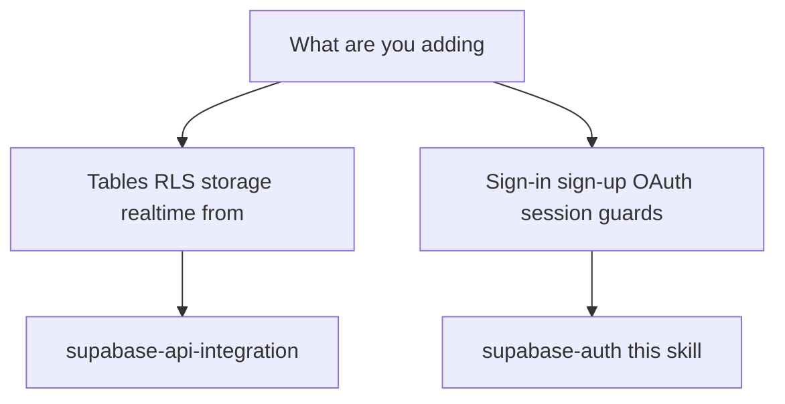

# Supabase Auth

**How to use this skill:** Scan the tree → if you match **this** skill, open **`references/workflow.md`** and run steps in order; open other `references/*.md` only for the row you need (snippets, not prose to memorize).

---

## Decision tree

- **Data plane** (`getSupabaseClient().from(...)`, `.throwOnError()`, types): **supabase-api-integration** — Auth is explicitly out of scope there.
- **Auth plane** (`supabase.auth.*`, cookies-less client session): **this skill** only.

---

## Preconditions (3 checks)

1. `NEXT_PUBLIC_SUPABASE_URL` + `NEXT_PUBLIC_SUPABASE_ANON_KEY`; `@supabase/supabase-js` installed.
2. `QueryProvider` → **`AuthProvider`** (order fixed) in root `layout.tsx`.
3. Shared `getSupabaseClient()`: add `auth: { persistSession, autoRefreshToken, detectSessionInUrl }` (full snippet: `references/workflow.md` Step 2). If **supabase-api-integration** Step 2 says “no auth config”, **this skill wins** when both apply.

---

## References (pick one file)

| Open… | When |
|--------|------|
| `references/workflow.md` | Default — ordered implementation |
| `references/folder-structure.md` | Where files go |
| `references/session-and-guards.md` | AuthProvider, useSession, useAuth, guards, **callback outside `(auth)/`** |
| `references/login-and-signup.md` | Email/password + mutations + pages |
| `references/google-oauth.md` | Google OAuth + disabled-provider contract (`isSupabaseGoogleProviderDisabledError` in `googleAuthErrors.ts` + authorize URL gate) + dashboard/Google Cloud setup |
| `references/phone-otp.md` | Phone OTP (SMS): `signInWithOtp` + `verifyOtp` + **disabled-provider fallback** + rate-limit handling |
| `references/password-reset.md` | Forgot / reset / change password |

**Elsewhere (do not duplicate here):** **supabase-api-integration** `SKILL.md` (layering, `queryClient`). **api-integration** `mutation-with-loader.md`, `skeletons.md`. **translation**, **components**, **coding-principles**, **next-best-practices**.

---

## Non-negotiables (violations = wrong implementation)

| Rule | One line |
|------|------------|
| Auth errors | No `.throwOnError()` on auth — `const { data, error } = await …; if (error) throw error` in **services only** (`login-and-signup.md`). |
| UI errors | Show original Supabase error from catch (`error instanceof Error ? error.message : 'Authentication failed'`). |
| Session | **`AuthProvider`** alone runs `getSession` + global `onAuthStateChange` → `queryClient.setQueryData(authKeys.*)`. **`useSession`** reads cache only — no `getSession` in UI. **No `AuthService.getSession` for product code.** |
| Layering | **`AuthService`** = all `supabase.auth.*` for mutations. **Exception:** `(auth)/reset-password/page.tsx` may subscribe **only** for `PASSWORD_RECOVERY` (`password-reset.md`). |
| Callback | **`app/auth/callback/page.tsx`** at app root — **not** under `(auth)/` — `Routes.AUTH_CALLBACK = '/auth/callback'` (`session-and-guards.md`). |
| Redirects | `router.replace(Routes.*)`; `emailRedirectTo` / OAuth `redirectTo` = `` `${origin}${Routes.AUTH_CALLBACK}` ``. |
| Sign-out | `queryClient.removeQueries({ queryKey: authKeys.all })` **then** `auth.signOut()` **then** `replace(LOGIN)` (`session-and-guards.md`). |
| Mutations | `useMutation<R, Error, V>`; global `queryClient` — same discipline as **supabase-api-integration**. |
| Copy | User-facing strings → **translation** skill; forms → **yup** + `translate('VALIDATION.*')` (`login-and-signup.md`). |
| `createClient` | `auth: { persistSession: true, autoRefreshToken: true, detectSessionInUrl: true }` — `detectSessionInUrl` required for `?code=` flows (`workflow.md` Step 2). |
| Google disabled | Follow **`references/google-oauth.md`** (`googleAuthErrors.ts`, browser redirect flow, **`ERRORS.GOOGLE_OAUTH_DISABLED`**) — never raw `/auth/v1/authorize` JSON. |
| Phone disabled | Follow **`references/phone-otp.md`** (disabled-provider UI, rate limits verbatim, no auto-retry) — never raw Supabase text or full-page JSON. |

---

## File checklist (high level)

**Once:** `supabaseClient` auth options · `authSchemas` · `AuthService` · `hooks/auth/*` · `useAuth` · `AuthProvider` · `PublicRoute` / `PrivateRoute` / `GoogleSignInButton` · **`lib/supabase/googleAuthErrors.ts`** when Google OAuth is used (`references/google-oauth.md`) · **`PhoneProviderDisabledDialog`** + `(auth)/phone/page.tsx` + `usePhoneOtpForm` when Phone OTP is used · `(auth)/layout` + pages · **`app/auth/callback/page.tsx`** · `(private)/layout` · `Routes` + i18n keys.

**Extend:** new `AuthService` method with `if (error) throw error` · typed mutation · route/form wiring.

**Tree + filenames:** `references/folder-structure.md`.

---

## Out of scope

`@supabase/ssr` / cookie sessions / `middleware.ts` / server `route.ts` callbacks · PostgREST/RLS/realtime/storage (**supabase-api-integration**) · One-Tap / native Google SDKs · email magic link · WhatsApp / voice OTP / MFA / native SMS retriever · mock OAuth instead of real Google · dashboard-only SMTP/templates/CAPTCHA / SMS credentials.
