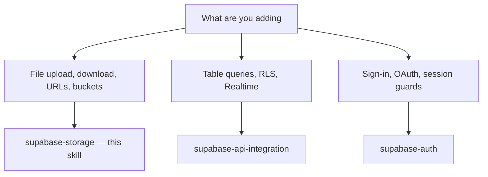

# Supabase Storage

**How to use this skill:** Read this file for all rules. Open `references/workflow.md` for ordered steps; open other `references/*.md` only for the section you need.

---

## Decision tree



- **Storage plane** (`supabase.storage.*`, buckets, files): **this skill** only.
- **Data plane** (`.from(table)`, PostgREST, Realtime): **supabase-api-integration**.
- **Auth plane** (`supabase.auth.*`, sessions): **supabase-auth**.

---

## Preconditions (4 checks)

1. `NEXT_PUBLIC_SUPABASE_URL` + `NEXT_PUBLIC_SUPABASE_ANON_KEY` set; `@supabase/supabase-js` installed.
2. Shared `getSupabaseClient()` exists at `apps/frontend/src/lib/supabase/supabaseClient.ts`. If missing, follow **supabase-api-integration** workflow Step 2 first.
3. Bucket is created and configured by the agent via MCP (`mcp__supabase__*`) during the DB/storage design phase — **never** instruct the user to create buckets manually in the Supabase dashboard. RLS policies are applied via the same MCP migration.
4. **Auth check** — if the bucket uses auth-based RLS (owner pattern, workspace pattern): **supabase-auth** must be set up and the user must be authenticated before any storage operation is attempted. Use `useSession` from **supabase-auth** to read the session; gate query hooks with `enabled: !!session && !!bucket`; guard mutation calls with a session check before `mutate()`. Public buckets (read-only, no user data) are exempt.

---

## References (pick one file)

| Open… | When |
|--------|------|
| `references/workflow.md` | Default — ordered implementation |
| `references/folder-structure.md` | Where files go, naming conventions |
| `references/service-layer.md` | `storage.ts` — types, contract, passthrough table, non-passthrough bodies |
| `references/hooks.md` | TanStack Query v5 hooks, query keys, mutations |
| `references/rls-policies.md` | Bucket RLS policies + Row-level storage policies |

---

## Mandatory patterns (single source)

### Error handling — NO `.throwOnError()`

Storage API does **not** expose `.throwOnError()`. Always use explicit destructuring in the hook:

```typescript
const { data, error } = await supabase.storage.from(bucket).upload(path, file);
if (error) throw error;
return data;
```

**Never** use `.throwOnError()` on any storage chain. **Never** swallow errors in hooks.

### Service layer

- All storage functions live in `apps/frontend/src/lib/supabase/storage.ts` as **named exports** (not a class).
- Functions accept `supabase: SupabaseClient` as first argument — never call `getSupabaseClient()` inside the service module itself.
- Service functions return the raw `{ data, error }` from the SDK (let the hook throw on error).

### Hook layer

- Hooks live in `apps/frontend/src/hooks/useSupabaseStorage.ts`.
- Hooks call `getSupabaseClient()` internally and pass the client to service functions.
- Query hooks: use `enabled: !!bucket && !!path` to prevent queries with empty keys.
- Mutation hooks: call `queryClient.invalidateQueries` in `onSuccess` to keep lists fresh.
- `usePublicUrl` is **synchronous** (no `useQuery`) — `getPublicUrl` is a sync SDK call.

### Query keys factory

Use a single `storageKeys` object: prefix `['storage', …]`; include every variable that affects the fetched data (e.g. `files` must include optional `listV2` **options** so cache keys stay stable). **Canonical `storageKeys`, shared hook shell, and per-hook `queryFn` / `mutationFn` bodies** are in `references/hooks.md`.

### Cache invalidation on mutations

`invalidateQueries({ queryKey: storageKeys.files(bucket) })` matches any query key whose first segments are `['storage', 'files', bucket, …]` (partial match), so list hooks refresh without listing every folder/options variant.

| Mutation | Invalidate |
|----------|-----------|
| `useUploadFile` | `storageKeys.files(bucket)` |
| `useUpdateFile` | `storageKeys.files(bucket)` + `storageKeys.fileInfo(bucket, path)` + `storageKeys.download(bucket, path)` + `storageKeys.downloadBase64(bucket, path)` |
| `useDeleteFiles` | `storageKeys.files(bucket)` |
| `useMoveFile` | `storageKeys.files(bucket)` |
| `useCopyFile` | `storageKeys.files(bucket)` |

### Image transforms

Pass `TransformOptions` (from `@supabase/storage-js`) to `getPublicUrl`, `createSignedUrl`, or `downloadFile`:

```typescript
import type { TransformOptions } from '@supabase/storage-js';

const opts: TransformOptions = { width: 400, height: 300, resize: 'cover', format: 'webp', quality: 80 };
```

Only works with **image** files in buckets with image transformation enabled in Supabase dashboard.

### Signed upload URLs

For secure client-side uploads without exposing bucket policies:

1. Server/service generates signed upload URL via `createSignedUploadUrl`.
2. Client uploads directly using `uploadToSignedUrl` with the returned `token`.

### Bucket policies

- Align policies with the **anon key** — users can only perform what RLS allows.
- Owner pattern: prefix paths with `${user_id}/filename.ext` enforced by policy `(storage.foldername(name))[1] = auth.uid()::text`.
- Public buckets: set `public: true` in `BucketConfig` — no signed URLs needed for reads.
- See `references/rls-policies.md` for complete policy SQL.

---

## Non-negotiables (violations = wrong implementation)

| Rule | One line |
|------|----------|
| Error handling | No `.throwOnError()` on storage — `const { data, error } = await …; if (error) throw error` |
| No bucket management in generated code | Buckets are created/configured by the agent via MCP — no `createBucket` / `deleteBucket` in generated frontend code |
| No client in components | `getSupabaseClient()` stays in hooks — never call in JSX or render body |
| No service calls in components | `queryFn` / `mutationFn` call service functions; UI imports hooks only |
| `usePublicUrl` is sync | Call `getPublicUrl(supabase, bucket, path)` directly — no `useQuery` wrapper |
| `enabled` guards | Every query hook must have `enabled: !!bucket && !!path` (or equivalent) |
| **Auth gate on protected buckets** | Add `!!session` to `enabled` for any bucket with auth-based RLS. Guard `mutate()` calls — if no session, redirect to login instead of calling the mutation. Never let an unauthenticated user trigger a storage write. |
| Typed mutations | `useMutation<ResponseType, Error, VariablesType>` always |
| i18n | User-visible strings → **translation** skill |
| Uploads include metadata | Always set `cacheControl`, `contentType` on upload when known |

---

## File checklist

**Once per app**

- [ ] `apps/frontend/src/lib/supabase/storage.ts` — service layer with all storage functions
- [ ] `apps/frontend/src/hooks/useSupabaseStorage.ts` — TanStack Query hooks + `storageKeys`

**Per feature using storage**

- [ ] Bucket created and configured by agent via MCP (not by user in dashboard, not by frontend code)
- [ ] RLS policies applied via agent MCP migration (`references/rls-policies.md`)
- [ ] **Auth check** — if bucket uses auth-based RLS: `useSession` guard on query `enabled`; session check before `mutate()`; component wrapped in `PrivateRoute` (**supabase-auth** skill)
- [ ] Upload mutation with `contentType` + `cacheControl`
- [ ] Public URL or signed URL based on bucket visibility
- [ ] Cache invalidation in mutation `onSuccess`
- [ ] Translations for user-facing messages (**translation** skill)

---

## Out of scope

PostgREST table queries / RLS on tables (**supabase-api-integration**) · Auth/sessions (**supabase-auth**) · `@supabase/ssr` / server-side storage calls · Non-Supabase file hosting (S3, Cloudinary) · Video streaming / chunked uploads · Resumable uploads (TUS protocol — use Supabase JS v2 `.upload()` with `resumable: true` option separately).
